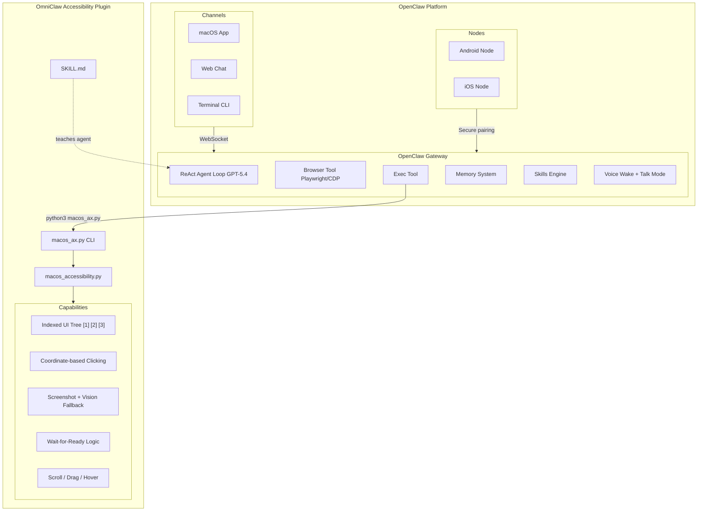
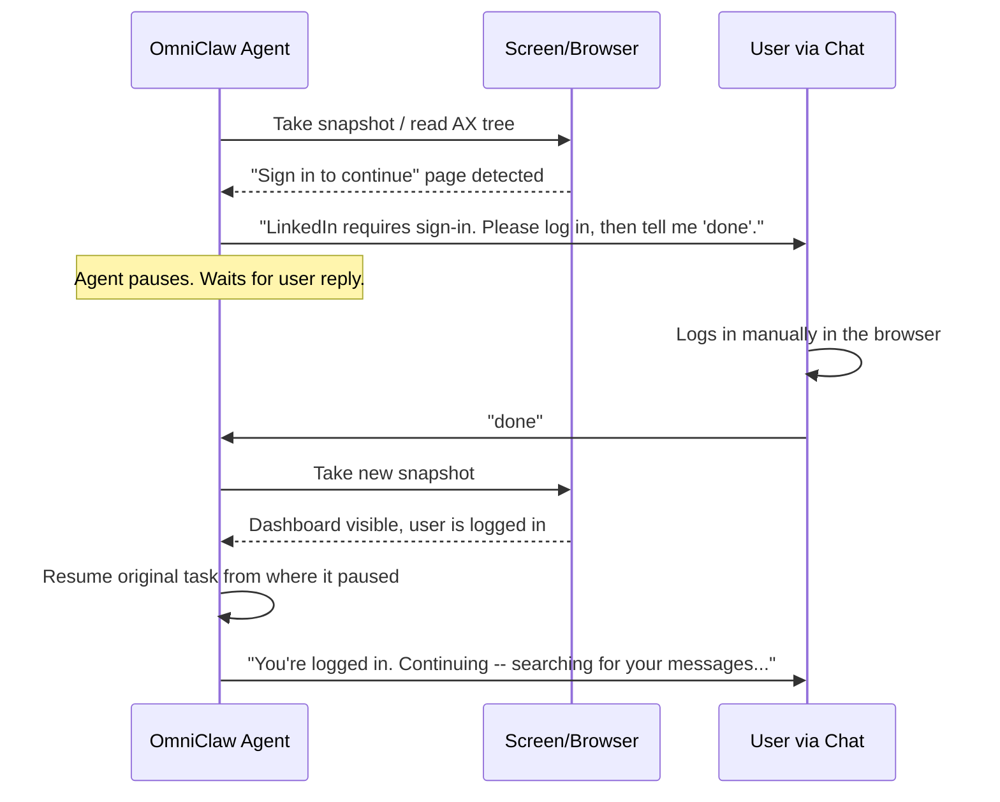
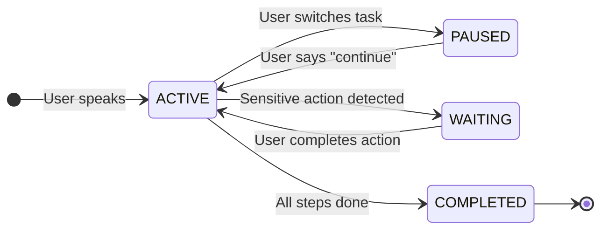

# OmniClaw -- Complete Product Vision

## What OmniClaw Is

OmniClaw is an Accessibility plugin for OpenClaw that gives AI agents the power to control any native application on any device through Accessibility APIs. It is not a standalone app -- it extends OpenClaw's existing agent platform with the ability to click buttons, read UI trees, type text, scroll, and navigate native applications that live outside the browser.

OpenClaw already provides the agent brain (ReAct loop), browser automation (Playwright/CDP), voice wake, talk mode, memory, skills, and cross-device pairing via nodes. OmniClaw adds the missing piece: **native app UI control** -- the ability to interact with applications like Notes, Finder, Microsoft Teams, Slack, Netflix, System Settings, and any other installed application.

The architecture is simple: OpenClaw is the brain, OmniClaw is the hands. The agent thinks and plans using OpenClaw's ReAct loop, then executes native app interactions through OmniClaw's Accessibility layer via the `exec` tool. Browser tasks still use OpenClaw's built-in browser tool. The agent decides at runtime which tool layer to use based on the task and what apps are installed.

OmniClaw is local-first. The Accessibility layer runs entirely on-device. No data leaves your machine. The only external calls are to the LLM provider (OpenAI GPT-5.4) for reasoning.

---

## The Core Problem

Today, to accomplish anything on a computer or phone, you must manually navigate through apps -- clicking buttons, typing text, scrolling through lists, switching between applications. Every task, no matter how routine, requires your hands and your attention.

Voice assistants like Siri, Google Assistant, and Alexa handle a narrow set of pre-programmed commands ("set a timer", "play music"). They cannot navigate arbitrary apps, fill forms, compose emails, add items to carts, or perform the thousands of custom workflows you do daily.

OmniClaw solves this. It sees what's on your screen (via Accessibility APIs, not screenshots), understands your intent (via LLM reasoning), and controls any app exactly the way you would -- by reading UI elements, clicking buttons, typing text, and scrolling. It learns your patterns, caches successful workflows, and gets faster over time. It handles sensitive actions safely by pausing and asking for your confirmation.

---

## The Vision: A Day with OmniClaw

**Morning -- Mac**

You sit at your MacBook. The OmniClaw icon sits in the menu bar, a small claw icon, glowing softly to indicate it's listening.

"Hey OmniClaw, check if my Amazon package shipped."

OmniClaw opens Safari, navigates to amazon.in, goes to your orders, finds the latest order, reads the tracking status, and tells you: "Your order of AirPods Pro is out for delivery. Expected by 2 PM today."

You never touched the keyboard. The task took 12 seconds. The first time you asked this, OmniClaw's LLM planned every step. The second time, it replayed the cached plan in 3 seconds.

"Hey OmniClaw, compose an email to john@example.com about tomorrow's standup."

OmniClaw opens Gmail in the browser, clicks Compose, fills in the recipient, writes a subject line and body based on your instruction, and then shows you the draft in the OmniClaw chat window: "Here's the draft. Subject: 'Quick Sync Tomorrow'. Body: 'Hi John, confirming our standup at 10am...' Should I send it?"

You say "Change the time to 11am and send."

OmniClaw updates the body, clicks Send, and confirms: "Email sent."

**Afternoon -- Phone**

You're on your Android phone. OmniClaw runs as a foreground service with a persistent notification and a floating bubble.

"Hey OmniClaw, order biryani on Swiggy."

OmniClaw opens Swiggy, searches for biryani, picks the restaurant you ordered from last time (it remembers from memory), adds biryani to cart, and navigates to checkout. Then it pauses:

"Your order is ready. Total: Rs 350. Please complete payment yourself -- I can't enter card details."

You complete the payment manually. OmniClaw detects the order confirmation screen, and tells you: "Order confirmed! Estimated delivery: 35 minutes."

**Evening -- Cross-Device**

You're on your phone and say: "Hey OmniClaw, in the Downloads folder on my Mac, there's a document called 'Offer Letter'. Send it to me on WhatsApp."

Your phone's OmniClaw agent recognizes this is a cross-device task. It sends a command to your Mac's OmniClaw agent via the local network (gRPC over mTLS). The Mac agent opens Finder, navigates to Downloads, locates the file. The file is transferred back to the phone. The phone agent opens WhatsApp, starts a chat with you, attaches the document, and sends it.

"Done. Your 'Offer Letter' document has been sent to your WhatsApp."

You also say: "Hey OmniClaw, scan all my emails on my phone and tell me when I received my offer letter from Acme Corp."

This time, OmniClaw on your phone handles it entirely -- no Mac needed. It opens Gmail on the phone, searches for "Acme Corp offer letter", scrolls through results, finds the email, and tells you: "You received your offer letter from Acme Corp on March 15, 2026."

---

## Architecture: OpenClaw + OmniClaw Plugin



### Why This Architecture

- **OpenClaw is the brain**. It provides a proven, production-grade ReAct agent loop, built-in Playwright browser control, an exec tool for running shell commands, a memory system, a skills engine, voice wake, talk mode, and cross-device pairing via nodes. We don't reinvent any of this.
- **OmniClaw is the hands**. It provides the Accessibility layer that OpenClaw doesn't have -- the ability to read native app UI trees, click elements by index, type text, scroll, take screenshots, and navigate any installed macOS application.
- **The SKILL.md teaches the agent** when and how to use the Accessibility layer. The agent decides at runtime whether to use the browser tool (for websites) or the exec tool with `macos_ax.py` (for native apps).
- **Android and iOS** connect as OpenClaw nodes with their own Accessibility layers (AccessibilityService on Android, limited Shortcuts on iOS). Cross-device tasks flow through the OpenClaw gateway.
- **No custom app needed**. OpenClaw's own macOS app, web chat, or terminal CLI serve as the user interface. Voice interaction uses OpenClaw's built-in voice wake and talk mode.

---

## The Agent Brain

### How the Agent Thinks

OmniClaw uses a ReAct (Reason + Act) agent loop. The LLM receives the user's request, the current screen state (Accessibility tree), and its memories. It reasons about what to do, calls a tool (click a button, type text, open a URL), observes the result, and loops until the task is done.

```
User: "Search for iPhone 17 on Amazon and add to cart"

Agent thinks: I need to open Amazon in the browser, search for iPhone 17, 
              find the product, and add it to cart.

Step 1: browser open amazon.in
        -> Observes: Amazon home page loaded

Step 2: browser snapshot -> sees search bar at index [3]
        browser type [3] "iPhone 17" submit=true
        -> Observes: Search results page with products

Step 3: browser snapshot -> sees first product at index [7]
        browser click [7]
        -> Observes: Product detail page

Step 4: browser snapshot -> sees "Add to Cart" button at index [12]
        browser click [12]
        -> Observes: Cart confirmation popup

Agent: "Added iPhone 17 to cart. Price: Rs 1,54,900. 
        Ready to proceed to checkout?"
```

The agent is fully autonomous. It decides which tools to use, in what order, based on what it sees on screen. There are no hardcoded workflows per app. The same agent handles Amazon, Gmail, LinkedIn, Notes, Finder, or any other application.

### Three-Layer Tool Routing

The agent decides at runtime which tool layer to use based on what apps are installed:

1. **Native app** (exec + macos_ax.py): Preferred when the app is installed. Notes, Finder, Calendar, Teams, Slack, System Settings, or any native macOS app. Uses pyobjc AXUIElement with indexed elements -- every actionable element gets a number `[1] [2] [3]` and the agent clicks by index using coordinate-based mouse events.

2. **Browser tool** (OpenClaw built-in): For websites and web apps. Amazon, Gmail, LinkedIn, YouTube. Uses Playwright/CDP with snapshot-based indexed elements.

3. **Fallback** (web_fetch / web_search): For read-only information retrieval when no interaction is needed.

When native app control fails (e.g., Electron app doesn't expose content in AX tree), the agent takes a screenshot, sends it to GPT-5.4 vision, or falls back to the web version via browser.

The SKILL.md teaches the agent:

```
1. Run list-apps to check what's installed
2. If native app available -> launch, tree --flat, click --index N
3. If AX tree insufficient -> screenshot --app, send to vision model
4. If still can't read -> fall back to browser (web version)
5. If web-only service -> use browser directly
6. Cross-app: browser for web data, then exec for native app
```

### Three-Tier LLM Strategy

OmniClaw uses OpenAI's GPT-5.4 family with three tiers optimized for different jobs:

- **GPT-5.4** ($2.50 / $15 per 1M tokens): Flagship reasoning. Used for planning multi-step tasks, executing tool calls, and replanning when things go wrong. This is the brain that reads UI trees and decides what to click.

- **GPT-5.4-mini** ($0.75 / $4.50 per 1M tokens): Fast classification. Used for observation loops (detecting whether payment completed, monitoring login screens), and for vision analysis when screenshots are needed.

- **GPT-5.4-nano** ($0.20 / $1.25 per 1M tokens): Ultra-cheap bulk tasks. Used for conversation routing (is this a new task or a continuation?), device routing (should this run on Mac or phone?), plan cache matching, and background pattern synthesis.

The user can switch providers in Settings. The architecture is provider-agnostic -- Anthropic Claude, Google Gemini, or local models via Ollama work with the same tool definitions.

---

## Human-in-the-Loop: Safety by Design

### Sensitivity Classification

Every action the agent takes is classified by the LLM into one of four sensitivity levels:

| Level | Name | Behavior | Examples |
|-------|------|----------|----------|
| 0 | Safe | Execute immediately, no notification | Open app, scroll, navigate, read content, search |
| 1 | Reversible | Execute immediately, show in progress | Add to cart, bookmark, save draft, change settings |
| 2 | Important | Ask user for confirmation in chat before executing | Send message, place order, delete item, post comment |
| 3 | Sensitive | Tell user to complete manually -- agent NEVER enters this data | Payment, OTP, password, card number, account deletion |

The classification is not keyword-based. The LLM understands context. It knows that "Place Order" on a checkout page is Level 2, while "Order Now" on a product listing page is Level 1 (just adds to cart). It knows that a text field labeled "Password" is Level 3, even in non-English apps.

### Login Detection and Resume

When the agent encounters a login wall:



This is not a separate detection system. The LLM naturally recognizes login screens, CAPTCHA challenges, 2FA prompts, "session expired" pages, and "account locked" screens -- all from the Accessibility tree or browser snapshot. It pauses, communicates via the chat interface, and resumes when the user confirms.

### Payment Flow

When the agent reaches a payment page:

1. Agent recognizes checkout/payment screen (sensitivity Level 3)
2. Agent pauses and messages the user in the chat: "Your order is ready. Total: Rs 350. Please complete payment yourself."
3. Agent releases screen control but passively monitors (every 2 seconds, reads the UI tree)
4. When payment completes (order confirmation screen detected), agent resumes automatically
5. Agent confirms: "Order confirmed! Estimated delivery: 35 minutes."

The agent NEVER enters card numbers, CVVs, OTPs, or passwords. NEVER. These fields are treated as radioactive -- the agent won't even read their values from the Accessibility tree.

---

## Memory System

### What OmniClaw Remembers

OmniClaw has three layers of memory:

**Short-term memory** (current session):
- The current task plan and progress
- Recent UI tree snapshots (last 3)
- Conversation history (last 10 turns)

**Long-term memory** (persists across all sessions):
- User preferences: "User prefers dark mode", "User's default Swiggy address is..."
- App knowledge: Screen fingerprints, navigation maps, known UI quirks
- Contact graph: "Mom = +91-xxxxx", "John's email = john@example.com"
- Correction signals: When you say "no, not like that, do X instead", the corrected approach is stored permanently with high confidence
- Reinforcement signals: When you say "perfect, always do it that way", the confirmed approach is stored as a preference

**Episodic memory** (task history):
- Every completed task: what was asked, what steps were taken, whether it succeeded, how long it took
- Failure patterns: which apps/actions tend to fail and why
- Success shortcuts: cached plans for repeat tasks

### Retrieval Strategy

Memory retrieval uses hybrid search: 70% vector similarity (semantic understanding) + 30% FTS5 keyword search. When you say "what did I order last time from that food app", vector search finds Swiggy episodes by meaning, while FTS5 catches the exact app name.

Only the top 5 most relevant memories are injected into the LLM context per call. Max 1K tokens of memory per call. Memory extraction after task completion runs as a fire-and-forget background task -- you get your response immediately, memory saves happen asynchronously.

### Security

- **Encryption at rest**: All memory stores encrypted with AES-256-GCM. Keys derived from user credentials via Argon2id (strongest KDF available).
- **OS Keychain for credentials**: API key stored in macOS Keychain / Android Keystore. NEVER in plain config files or SQLite.
- **Sensitive field redaction**: Password values, OTP values, card numbers are NEVER stored in any memory tier. Secure text fields (marked by the OS) are redacted before any storage or LLM call.

---

## User Interface

OmniClaw has no custom app. Users interact with the agent through OpenClaw's built-in channels:

- **OpenClaw macOS App**: Menu bar icon, chat interface, voice wake, talk mode
- **OpenClaw Terminal CLI**: `openclaw` command for text-based interaction
- **OpenClaw Web Chat**: Browser-based chat at the gateway's web dashboard

### Setup (< 60 Seconds)

1. **Install OpenClaw**: `npm install -g openclaw@latest && openclaw onboard`
2. **Install Python deps**: `pip install -r requirements.txt`
3. **Grant Accessibility**: System Settings -> Privacy & Security -> Accessibility -> Add Terminal
4. **Copy skill**: `cp -r skills/macos-accessibility ~/.openclaw/workspace/skills/`
5. **Start**: `openclaw`

---

## Multi-Device: OpenClaw Nodes

OmniClaw leverages OpenClaw's built-in node system for cross-device tasks:

- **Android Node**: OpenClaw Android app pairs with the Gateway. Provides device commands (contacts, SMS, camera, calendar, notifications). The Accessibility layer (AccessibilityService) extends this with native app control.
- **iOS Node**: OpenClaw iOS app pairs with the Gateway. Provides camera, canvas, location. Limited app control (Apple sandboxing).
- **Secure Pairing**: mDNS/Bonjour discovery, bootstrap token, explicit CLI approval. Encrypted WebSocket communication.

### Cross-Device Task Flow

```
User on Mac: "Send me my resume from Downloads on WhatsApp"

Agent:
1. exec python3 macos_ax.py launch "Finder"
2. Navigate to Downloads, find resume.pdf
3. Use messaging channel to transfer file to phone
4. Phone node delivers via WhatsApp
```

The agent decides at runtime which device handles each step. No hardcoded routing.

---

## Accessibility Layer: How OmniClaw Controls Apps

### macOS: AXUIElement via pyobjc (Indexed Element System)

OmniClaw reads the macOS Accessibility tree -- the same structured data that VoiceOver uses. Every button, text field, menu item, and label is represented as a node with a role, label, value, position, and available actions.

The key innovation is the **indexed element system**: every actionable element in the UI gets a sequential number `[1] [2] [3]`. The agent sees a numbered list and clicks by index -- no guessing element labels. Positions are stored in a registry file, and clicking uses coordinate-based CGEvent mouse events (works on all apps, including Electron).

Full command set via `macos_ax.py` CLI:

| Command | What It Does |
|---------|-------------|
| `launch "App"` | Open app, wait until ready, return indexed tree |
| `focus "App"` | Bring app window to front |
| `quit "App"` | Quit app gracefully |
| `tree --flat` | Read indexed UI tree [1] [2] [3] |
| `tree --flat --app "Teams"` | Read specific app tree |
| `tree --flat --verbose` | Include positions in output |
| `click --index 3` | Click element by index (coordinate-based) |
| `click --label "Send"` | Click element by label |
| `click-at 500 300` | Click at pixel coordinates |
| `double-click --index 3` | Double-click element |
| `right-click --index 3` | Right-click element (context menu) |
| `type "Hello"` | Type text into focused field |
| `type "Hello" --index 5` | Focus element by index, then type |
| `shortcut "cmd+n"` | Keyboard shortcut |
| `scroll down 3` | Scroll wheel down (CGEvent) |
| `scroll up 3` | Scroll wheel up |
| `screenshot` | Capture full screen |
| `screenshot --app "Teams"` | Capture app window |
| `hover 500 300` | Move mouse without clicking |
| `drag 100 200 500 400` | Click-drag between points |
| `list-apps` | List installed/running apps |
| `focused-app` | Get focused app name |
| `screen-size` | Get screen dimensions |

All output is JSON. The agent reads the indexed tree, picks the element number, and clicks by index. When the AX tree doesn't expose content (common in Electron apps), the agent takes a screenshot and uses GPT-5.4 vision as fallback.

### Android: AccessibilityService

Android's `AccessibilityService` provides the same capability as macOS AX but through a different API. OmniClaw's Android app extends `AccessibilityService` to:

- Read the UI tree via `getRootInActiveWindow().AccessibilityNodeInfo`
- Click elements via `performAction(ACTION_CLICK)`
- Type text via `performAction(ACTION_SET_TEXT, bundle)`
- Scroll via `performAction(ACTION_SCROLL_FORWARD/BACKWARD)`
- Dispatch gestures via `GestureDescription`
- Launch apps via `Intent`

Both platforms normalize their UI trees to a unified schema:

```
UINode {
    id: string              // Platform-specific unique ID
    role: string            // Normalized: button, text_field, list, image, etc.
    label: string           // Visible text / accessibility label
    value: string | null    // Current value (REDACTED for secure fields)
    enabled: boolean
    focused: boolean
    visible: boolean
    bounds: { x, y, width, height }
    actions: [string]       // Available: click, type, scroll, etc.
    children: [UINode]
}
```

### Browser: Playwright/CDP

For web tasks, OmniClaw uses Playwright via CDP (Chrome DevTools Protocol). This provides:
- Snapshot-based indexed elements: every clickable/typeable element gets a numbered index
- Click, type, scroll, evaluate JavaScript, take screenshots, manage tabs
- Works with any Chromium-based browser (Chrome, Edge, Brave, Arc)
- Isolated browser profile (OmniClaw doesn't interfere with your browsing)

---

## Smart Fixes for Known Risks

### UI Tree Instability

Apps update their UI dynamically -- animations, lazy loading, pop-ups. Elements become stale between reading and clicking.

**Fix**: Stability Gate (inspired by Playwright's actionability checks). Before every action, take two snapshots 50ms apart. Only act when the target element is visible, stable (same position in both snapshots), and not obscured by a modal. Element fingerprinting (hash of role + label + parent context) handles re-renders -- even if the platform ID changes, the semantic fingerprint stays the same.

### LLM Hallucination in Planning

The LLM might plan steps that don't exist in the app or reference non-existent UI elements.

**Fix**: Constrained Action Palette (inspired by WebArena). Instead of letting the LLM generate free-form element names, give it a numbered menu of exactly the elements on screen. The LLM picks a number, not a name. It literally cannot hallucinate a non-existent element. Combined with structured output enforcement -- the LLM's response is constrained at the token level to valid action formats.

### Context Window Saturation

Complex tasks fill the context window with UI trees, action results, and memory.

**Fix**: MemGPT-style tool-based memory. The agent manages its own context via tool calls (recall past steps, search memory, save facts). Proactive eviction at 60% context capacity. UI tree diffing -- after the first full snapshot, only send changes (~50 tokens instead of ~2K tokens per step).

### Plan Staleness After App Updates

A cached plan breaks because an app redesigned its UI.

**Fix**: Validate-before-execute. Each step checks if the current screen matches the expected fingerprint. If it matches, execute from cache (zero LLM cost). If it doesn't (app updated), fall back to LLM for just that step. The cache self-heals as changed screens are re-learned.

### First-Time App Learning Curve

The agent has never seen this app.

**Fix**: App fingerprinting on first encounter -- build a structural map of the app's screens and navigation elements by reading the Accessibility tree (no clicking required). Pre-built maps for the top 50 apps per platform ship with OmniClaw, so it already knows how to navigate popular apps on day 1.

### Cross-Device Network Issues

Devices go offline mid-task. Network drops.

**Fix**: Speculative execution with local fallback (inspired by Google Bigtable's hedged requests). When sending a cross-device command, simultaneously prepare a local fallback. If the remote device doesn't respond within 3 seconds, ask the user if they want to try locally. Capacity scoring tracks each device's real-time availability (CPU usage, screen lock status, meeting detection) to avoid routing to busy devices.

---

## Voice Pipeline

OmniClaw uses OpenClaw's built-in voice capabilities:

- **Voice Wake**: Configurable trigger word (default: "Ben"). Say the wake word, and the agent starts listening.
- **Talk Mode**: Real-time STT converts speech to text, agent processes the request, TTS speaks the response aloud.
- **Inactivity Timeout**: Voice session ends after 3 minutes of silence.

No custom voice code is needed. OpenClaw handles wake word detection, STT, TTS, and session management.

---

## Session and Conversation Management

### How OmniClaw Decides: New Task or Continuation?

Every incoming message is classified by the LLM. No time thresholds, no keyword matching. The LLM understands context:

- "Also add a Coke" (after ordering food) -> CONTINUE the current task
- "What's the weather like?" (after ordering food) -> START a new task
- "Go back to that Swiggy order" (hours later) -> RESUME an old task
- "Cancel it" -> LLM uses context to determine which task to cancel

This classification uses GPT-5.4-nano (~$0.00004 per decision) and runs in parallel with device routing and UI tree capture, adding zero sequential latency.

### Session Lifecycle



Sessions are checkpointed after every step. If the app crashes, the agent resumes from the last checkpoint. If you close your laptop and open it later, the task is still there, ready to continue.

---

## Cost Model

### What OmniClaw Costs to Run

OmniClaw uses a cache-first architecture. The first time you perform a task, the LLM plans and executes every step. After that, the plan is cached. Repeat tasks cost nearly nothing.

| Scenario | LLM Calls | Estimated Cost |
|----------|-----------|----------------|
| Cached task (repeat) | 1 nano call for cache match | ~$0.00004 |
| Simple task (5 steps) | 1 planner + 5 executor + 1 replanner | ~$0.04 |
| Complex task (15 steps) | 1 planner + 15 executor + 3 replanner | ~$0.12 |
| Session routing (per message) | 1 nano call | ~$0.00004 |
| Device routing (per message) | Part of intent parsing | $0.00 (included) |

After 1 week of usage, approximately 60% of tasks are served from cache (free). After 2 weeks, this rises to ~75%.

### Budget Controls

- **Pre-estimation**: Before starting a task, OmniClaw can show you the estimated cost ("This will cost ~$0.03. Proceed?"). Configurable in Settings.
- **Per-task budget**: If a task exceeds 80% of its token budget, OmniClaw pauses and asks if you want to continue.
- **Daily spending cap**: Hard limit set in Settings (default: $5.00). Agent stops when reached.
- **Usage dashboard**: Settings > Usage & Cost shows today/week/month breakdown, per-model token usage, and full task history with individual costs.

---

## Performance Targets

### Latency Breakdown (Novel Task, Async Architecture)

```
STT (speech to text):                                200ms
Parallel: route conversation + route device + read UI:  80ms  (bounded by slowest)
Parallel: memory search + cache check + context:       100ms
Planner (GPT-5.4):                                    800ms
5x Execute steps (sequential, each needs prior result):
  Each: parallel(UI read + memory) 50ms + GPT 500ms + action 100ms = 650ms
  Total: 5 x 650ms =                                3,250ms
Fire-and-forget (memory save, cache update):            0ms  (async, doesn't block)
TTS (starts streaming during last step):                0ms  (overlapped)

TOTAL:                                              ~4,430ms  (~4.4 seconds)
```

For cached tasks: STT 200ms + route 80ms + cache hit 10ms + replay 500ms = **~790ms** (< 1 second).

### Operations That Stay Sequential (Data Dependencies)

- Planner -> Executor: executor needs the plan
- Step N -> Step N+1: each step depends on the previous step's screen result
- UI read -> Action: must read current state before acting
- Guardrail check -> Tool execution: must validate before acting

These are data dependencies, not I/O bottlenecks. Async architecture doesn't try to parallelize them.

---

## File Structure

### Repository

```
omniclaw/
  tools/                                  # macOS Accessibility tools
    macos_accessibility.py                # Core AX layer (pyobjc, indexed elements)
    macos_ax.py                           # CLI wrapper for OpenClaw exec

  skills/
    macos-accessibility/
      SKILL.md                            # OpenClaw skill definition

  tests/
    TEST_CASES.md                         # Test documentation

  requirements.txt                        # pyobjc dependencies
  README.md
```

### OpenClaw Workspace

```
~/.openclaw/
  openclaw.json                           # Model + browser + exec config
  workspace/
    AGENTS.md                             # Operating instructions (routing logic)
    skills/
      macos-accessibility/                # Copy of repo skill
```

---

## Scaling Roadmap

### Phase 1: macOS Bulletproof (Current)
- Indexed element system for reliable native app control
- Coordinate-based clicking (works on all apps including Electron)
- Deep tree reading (depth 12, 200 elements, smart filtering)
- Screenshot + GPT-5.4 vision fallback for opaque apps
- Wait-for-ready logic, proper scroll wheel, drag/hover
- OpenClaw skill registration and AGENTS.md routing logic
- Tested on: Finder, Notes, Mail, Calendar, System Settings, Safari, Chrome

### Phase 2: Android AccessibilityService
- Extend OpenClaw Android node with AccessibilityService
- Same indexed element pattern adapted for Android UI tree
- Cross-device task flow: Mac agent controls phone apps via node
- File transfer bridge via messaging channel

### Phase 3: Advanced Automation
- Plan caching and screen-action cache (learning from usage)
- App fingerprinting for top 50 apps
- UI tree diffing (send only changes after first snapshot)
- Multi-provider LLM support (Anthropic, Gemini, local models)

### Phase 4: Cross-Platform
- Windows (UI Automation API)
- Linux (AT-SPI2)
- iOS (limited: Shortcuts framework, URL schemes)
- Developer SDK for custom integrations

---

## Technical Decisions Summary

| Decision | Choice | Rationale |
|----------|--------|-----------|
| Agent platform | OpenClaw | Proven ReAct loop, built-in Playwright, exec tool, memory, skills, voice, nodes. No custom agent code. |
| macOS native app control | pyobjc AXUIElement via CLI | Indexed elements, coordinate-based clicking, screenshot fallback. CLI wrapper callable from OpenClaw exec. |
| Android native app control | AccessibilityService (via OpenClaw node) | Official Android API. Full UI tree + actions. No root required. |
| Browser automation | Playwright/CDP (OpenClaw built-in) | Industry standard. Snapshot-based indexed elements. Tab management. |
| LLM provider | OpenAI GPT-5.4 family | Flagship reasoning + vision. Provider-agnostic architecture. |
| Voice | OpenClaw built-in (voice wake + talk mode) | No custom voice code needed. Configurable wake word. |
| Cross-device | OpenClaw nodes (secure pairing, WebSocket) | Hub-and-spoke model. mDNS discovery. Bootstrap token pairing. |
| User interface | OpenClaw macOS app / Web Chat / Terminal CLI | No custom app needed. Multiple channels supported. |

---

## Guiding Principles

1. **Don't reinvent the wheel.** OpenClaw already provides the agent brain, browser automation, voice, memory, skills, and cross-device pairing. OmniClaw adds only what's missing: native app UI control via Accessibility APIs.

2. **The LLM drives everything.** No hardcoded intents, no keyword matching, no pre-programmed workflows. The LLM understands what you want, sees the screen (via indexed AX tree or screenshot), and figures out how to do it.

3. **Local-first, always.** The Accessibility layer runs entirely on-device. Your API key is in the OS Keychain. The only external calls are to the LLM provider for reasoning.

4. **Safe by default.** The agent pauses before irreversible actions. It never enters passwords or payment details. It tells you when something needs your attention. You're always in control.

5. **Native-first, browser-fallback.** If an app is installed, use it natively via Accessibility APIs. If the AX tree is insufficient, take a screenshot and use vision. Only fall back to browser as a last resort.

6. **Gets smarter over time.** Every successful task is cached. Every correction is remembered. Every app the agent encounters is mapped. The system learns from usage.

---

*OmniClaw: The hands that make OpenClaw's brain move.*
